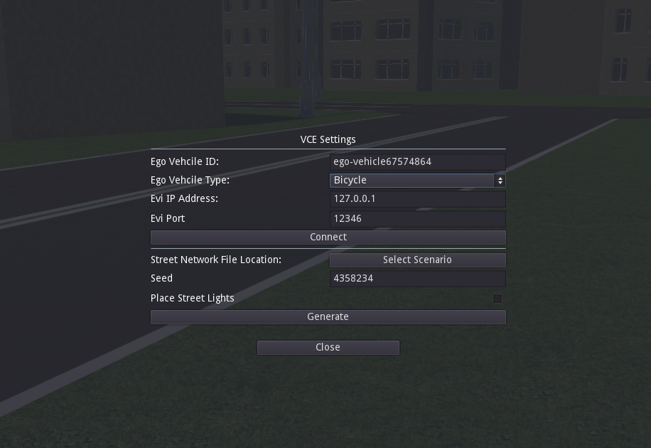

.. _3denv-getting-started:

3D Environment ("Driving Simulator")
====================================

The 3D environment, found in the ``3denvGodot`` directory, provides a real-time visualization of the simulation.
It can be run as a stand-alone component with keyboard input and without any other simulated vehicles besides the ego vehicle.
Typically, though, the 3D environment will be connected to a physical bicycle using the :ref:`bicycleinterface-getting-started` and to the :ref:`evi-getting-started` to allow for fellow traffic and vehicle-to-anything communication (V2X).

Requirements
------------

The 3D environment is built with the `Godot 3D game engine <https://godotengine.org//>`_. This project **requires the .NET version** of the game engine, which enables C# support. We recommend using the latest stable version 3.5.1

For development, Godot can interface with several IDEs such as JetBrains Rider or Visual Studio Code.

Generating a Street Network from an Existing Scenario
-----------------------------------------------------

Open ``3denvGodot/3denv/`` as a project in Godot. After that you can start the project by clicking the play button in the right corner of the screen or pressing the F5 key.
To generate a street network from an existing scenario, find the button "Select Scenario" in the game menu. A window will popup where you will be able to select your desired scenario. Existing scenarios can be found in the output folder ``street-environments/output``.

.. _fig-open-street-network-generator:

    Godot screenshot: Opening the game menu.

After selecting the desired scenario file, press generate to create the 3D environment. After starting up EVI, you can also press the connect button, in order facilitate the connection between Godot and EVI.

Further important configuration items include:

:Ego Vehicle Type:
    The type of vehicle you want to control.
    Use ``Bicycle`` if you want to control a bicycle with keyboard controls through the 3D environment itself.
    Use ``Bicycle_Interface`` if you intend to connect to the 3D environment with an instance of the :ref:`bicycleinterface-getting-started`.
    Use ``Car`` if you wish to control a car with your keyboard.

:Evi IP address:
    Address of the :ref:`evi-getting-started`.
    Make sure to stick to the format ``your-evi-address``.
    This setting can be changed after the street network is generated.
:Evi Port:
    Port number of the Evi connection with default value of 12346.

:Seed:
    Seed used for the environment generation. Affects the height of the buildings.    
:Place street lights:
    Toggle whether street lamps should be placed in the environment. Visual effect only.

