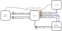

Getting Started
===============

This guide will give you an overview of the steps needed to run your first simulations with the Virtual Cycling Environment (VCE).
It is possible to follow these steps without having a sensors-equipped bicycle available.
In that case, omit running the :ref:`bicycleinterface-getting-started` and use keyboard controls in the :ref:`3denv-getting-started` instead.
For instructions on how to set up the bicycle, read :ref:`hardware-setup`.

.. toctree::
    :maxdepth: 1
    :name: toc-getting-started

    apptainer
    3denv
    sumo
    evi
    veins
    bikeinterface
    launcher
    multiplayer

What Is the Virtual Cycling Environment?
----------------------------------------

.. _fig-vce-hardware:
.. figure:: ../img/2022-11-07_vce.small.jpg

    The hardware of the VCE.

.. _fig-evi-message-sequence:

    Basic components of the VCE and how messages are exchanged between them.
    Figure based on :footcite:p:`buse2019towards`.

.. footbibliography::
