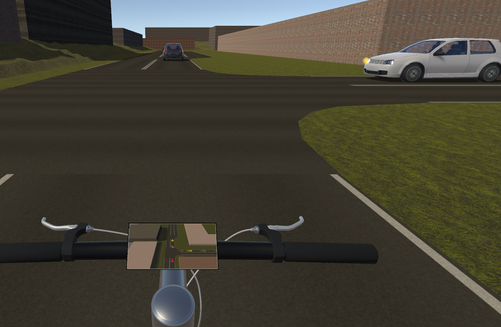

.. _veins-getting-started:

Veins
=====

Installation
------------

.. note::
   If you are using :ref:`the VCE container<apptainer-getting-started>`, you may skip these steps unless you made any changes and need to recompile.
   Make sure to run the commands for running a scenario from inside the container.

OMNeT++
^^^^^^^

Since Veins is an OMNeT++ subproject, the network simulator OMNeT++ is an essential prerequisite.
Follow the `installation instructions <https://doc.omnetpp.org/omnetpp/InstallGuide.pdf>`_ for an up-to-date version (as of writing this, tested with OMNeT++ 6.0).

Veins
^^^^^

Once OMNeT++ is fully installed and the environment variables ``PATH`` and ``LD_LIBRARY_PATH`` are set accordingly, you are ready to install Veins.
Download an up-to-date copy from the `Veins website <http://veins.car2x.org/download/>`_ (as of writing this, tested with Veins 5.2) and extract the archive to your preferred installation directory.
Then run the following commands in Bash:

.. code-block:: bash

    source ./setenv
    ./configure
    make

Use ``make -j8`` to make use of multiple processing cores, if available (in this example, 8).
As with OMNeT++, make sure to set up the environment variable ``PATH`` in your ``.bashrc`` or equivalent shell configuration files to include the ``bin/`` directory of Veins.

Refer to the `Veins tutorial <http://veins.car2x.org/tutorial/>`_ for further installation details, especially w.r.t. dependencies, and on how to run a demo scenario.

Veins-EVI
^^^^^^^^^

Navigate to the ``veins-evi`` subfolder of your VCE repository.
Then run the following:

.. code-block:: bash

    ./configure --veins <veins_path, .e.g, ~/veins/veins-5.2/>
    make

Running a VCE Scenario with V2X
-------------------------------

Minimap
^^^^^^^

The 3D Environment can show a minimap on the handlebar of the virtual bicycle.
If the ego vehicle receives context awareness messages (CAMs) from cars around it, the position of these cars at the time of transmission can be visualized.
This works with any scenario, but let us stick with ``paderborn-north`` in this example.

First, build the street network for ``paderborn-north`` as described in :ref:`3denv-getting-started`.
Make sure to select ``miniMap`` for the tablet application on the handlebar.

Next, start by launching the MiniMap example in ``veins-evi``.
In order to do so, navigate to ``veins-evi/examples/minimap/`` and run the following:

.. code-block:: bash

    ./run -u Cmdenv -c LanradioDisabled

Then launch the EVI by running the following in the ``evi/`` subfolder of your VCE repository:

.. code-block:: bash

    poetry shell
    cd networks/paderborn-north
    ../../scripts/evid.py --config-file paderborn-north.evi.ini --sumo-binary sumo-gui --veins-host localhost --veins-port 12347

Finally, start the 3D Environment.
Once the first other vehicles start arriving in the region of the ego vehicle, you should see indicator arrows on the MiniMap that will fade out over time, as shown in :numref:`fig-3denv-minimap`.

.. _fig-3denv-minimap:

    Unity screenshot: Indicators on the MiniMap from context awareness messages sent as beacons from fellow vehicles and received by the ego vehicle.
