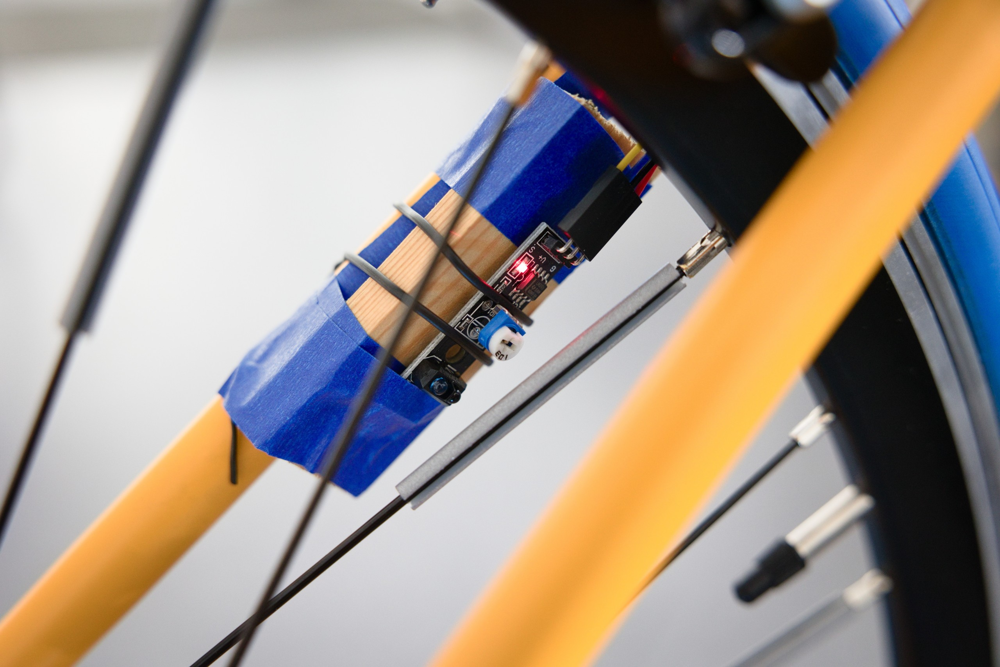
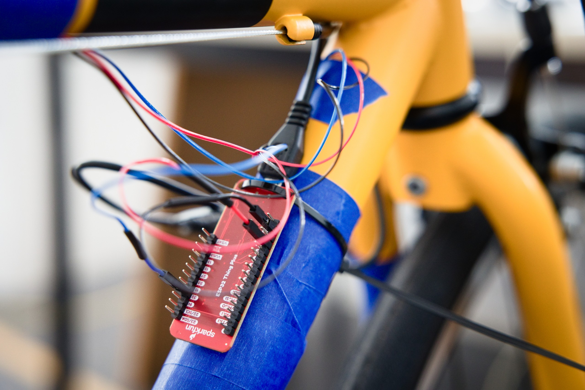

.. _hardware-setup:

Hardware Setup
==============

.. _fig-vce-hardware-setup:
.. figure:: ../img/2022-11-07_vce.small.jpg

   Overview of the hardware of the VCE.

Bicycle
-------

Almost any bicycle should work.
Try to make sure that it is of a size and form that will allow most of your participants to sit on it comfortably.

Training Stand
--------------

Avoid training stands that require removing the rear wheel, since this makes simulating the act of braking significantly more difficult.
In :numref:`fig-vce-hardware-setup` we used the Tacx® Boost trainer by Garmin.

Steering Sensor
---------------

Any Android smartphone with a compass and a gyroscopic sensor should work.
The smartphone can be attached to the handle bar with any rigid and compatible smartphone holder.

Speed Sensor
------------

We recommend using an infrared sensor for measuring the spinning rate of the rear wheel.
The :ref:`bicycleinterface-getting-started` supports some of the Tacx® smart trainers, but the update rate of these sensors tends to be very low.

.. _fig-speed-sensor:

   Infrared sensor attached close to the rear wheel.
   The red light indicates that it is currently registering one of the reflectors attached to the spokes.

.. _fig-esp32:

   ESP32 attached to the bicycle frame with cabling leading to the infrared sensor in :numref:`fig-speed-sensor`.

You can build your own infrared-sensor-based speed sensor with the following items:

* An ESP32 development board, for example Adafruit ESP32 Feather V2
* An infrared sensor module, for example `KY-033 <https://sensorkit.joy-it.net/en/sensors/ky-033>`_.
  Try to find a quick sensor that will not require a long debounce period for each detected spoke.
  We found that KY-033, though far from perfect, was more reliable in this regard compared to a Keyestudio IR Sensor Module.
* Some jumper wires of sufficient length, heat shrink tubing
* Either a long USB cable or a battery compatible with your development board for power
* Some solder and a soldering iron
* Reflectors for bicycle spokes as shown in :numref:`fig-speed-sensor`

Read :ref:`bicycleinterface-extension` to learn how to configure and flash your ESP32.
If you'd like to use the default configuration for the GPIO pins, connect the signal output of the IR sensor to GPIO 32 on the ESP32 development board.

Computer
--------

Any modern desktop computer with a graphics card running Linux should be sufficient.
Some scenarios may be more demanding than others, for example in the amount of car traffic that is simulated.
In this case, it is possible to spread out VCE components across several machines, for example, to run SUMO on a seperate computer from the 3D Environment.

Most recently we have been using a desktop computer with an AMD Ryzen™ 7 5800X processor, an Nvidia RTX 3070 graphics card, and a 3440 px by 1440 px monitor with a refresh rate of 144 Hz.
