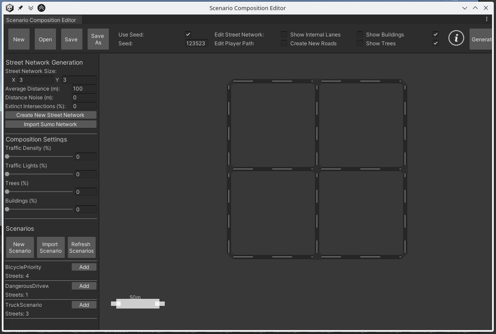
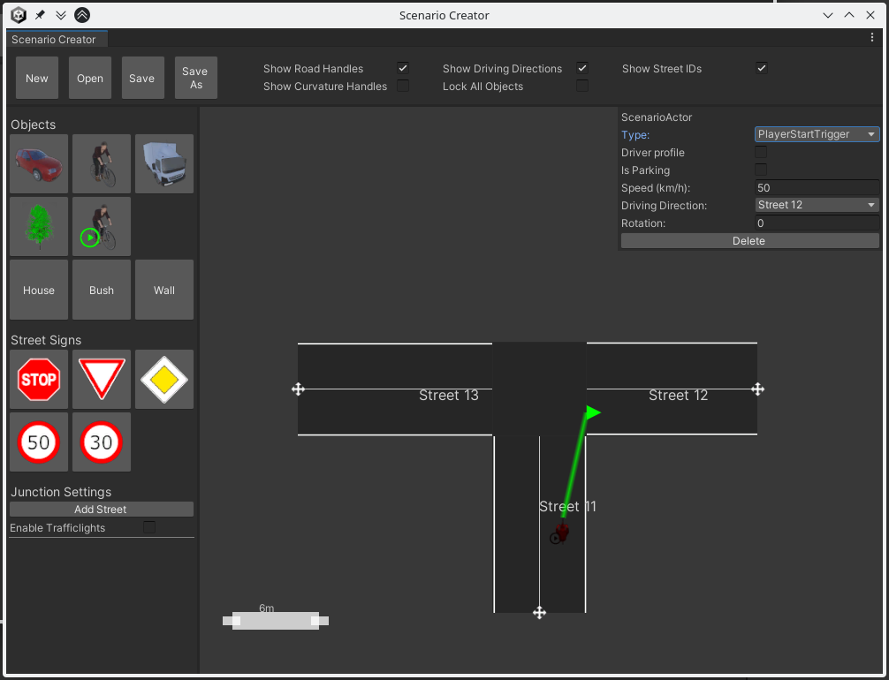
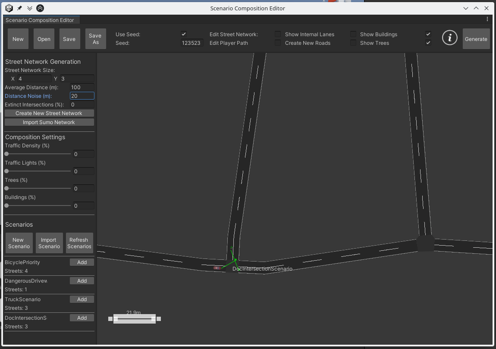
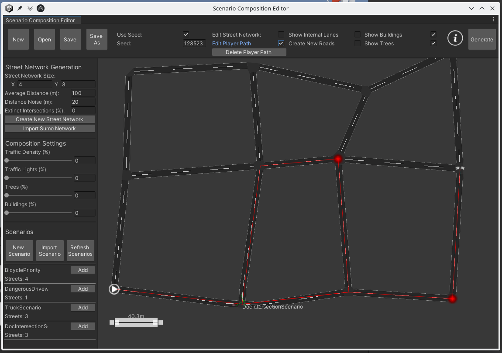

.. _experiment-creator:

Creating a New Experiment With the Experiment Creator
=====================================================

.. warning::

   This feature relies on the discontinued Unity implemenation of the 3D Environment, which is currently not part of our public VCE repository.
   Contact the developers if you need this feature.

The Experiment Creator consists of two main tools:

:The Scenario Composition Editor:
   For editing your street network, randomly placing trees or houses, positioning your intersection scenarios within the scene, and for selecting the ego vehicle path.
:The Scenario Creator:
   For defining what will happen at a specific intersection when the ego vehicle approaches from a defined direction.

To start using the Experiment Creator, open the 3D Environment in the Unity Editor, click on "VCE Components" and then on "Experiment Creator".
This will launch the Scenario Composition Editor as shown in :numref:`fig-scenario-composition-editor-startup`.
Before using the Scenario Composition Editor to set up a street network, let us define an intersection scenario to place on some of the intersections in the experiment.

.. _fig-scenario-composition-editor-startup:

   Unity screenshot: The Scenario Composition Editor after launching the Experiment Creator.

Creating a New Intersection Scenario
------------------------------------

In the bottom left corner of the Scenario Composition Editor, :numref:`fig-scenario-composition-editor-startup`, you can see a section titled "Scenarios" which already lists some pre-defined intersection scenarios.
To create a new intersection scenario, click "New Scenario".
This opens the Scenario Creator.
Then click on "Add Street" three times to get something as shown in :numref:`fig-scenario-creator-new-streets`.
Drag the handles at the end of each street to some more realistic positions, or alternatively, use the "Align" buttons in the popup menu when selecting one of the streets.

.. _fig-scenario-creator-new-streets:
.. figure:: ../img/scenario-creator_new-streets.png

   Screenshot of the Scenario Creator after clicking on "New Scenario" in the Scenario Composition Editor and then adding three streets.

Next, determine where the ego vehicle will enter the intersection.
To do this, click on the icon of the cyclist with a green 'play' button on top ("Player Start").
This will place a cyclist in the middle of the intersection.
Drag and drop this cyclist to the desired starting position as shown in :numref:`fig-scenario-creator_player-start`.
Use the popup menu to select your desired cycling direction.
Whatever you define to happen at this intersection will be triggered when the ego vehicle comes within range of this trigger point.

.. _fig-scenario-creator_player-start:

   Screenshot of the Scenario Creator after placing the ego vehicle starting position for this intersection.

Add additional road users, bushes, houses, or street signs as needed.
Then save your intersection scenario.

Using the Scenario Composition Editor
-------------------------------------

In :numref:`fig-scenario-composition-editor-startup`, the top section of the sidebar on the left offers some tools for the generation of street networks.
Experiment with the values and clicking "Create New Street Network" until you find a configuration you like.

In order to use the intersection scenario you created and saved previously, click "Import Scenario".
This will add your intersection scenario to the list at the bottom of the sidebar on the left.
Next, click the "Add" button for your intersection scenario and move your mouse over the street map.
You can use your mouse wheel to rotate the preview of the selected intersection scenario or the right mouse button to cancel the operation.
If you move your intersection scenario over a fitting intersection with the correct number of streets, the preview will snap to that intersection and you can confirm the placement with the left mouse button.
The result may look like :numref:`fig-scenario-composition-editor-placement`.

.. _fig-scenario-composition-editor-placement:

   Screenshot of a successfully positioned intersection scenario in the Scenario Composition Editor.

Before all necessary configuration files for the VCE can be generated, a path for the ego vehicle through the street network must be defined.
To do so, click the checkbox labeled "Edit Player Path" at the top of the Scenario Composition Editor.
Then click on each intersection in the sequence in which the ego vehicle is supposed to traverse them, as shown in :numref:`fig-scenario-composition-editor-path`.

.. _fig-scenario-composition-editor-path:

   Screenshot of the Scenario Composition Editor with "Edit Player Path" enabled, showing the selected ego vehicle path.

Finally, click "Generate" in the top right corner of the Scenario Composition Editor.
This will generate and save all necessary VCE configuration files to a folder.
